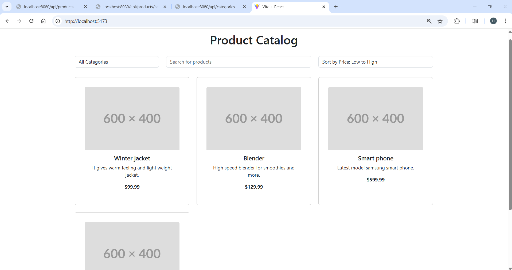
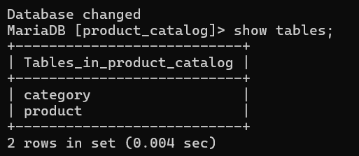
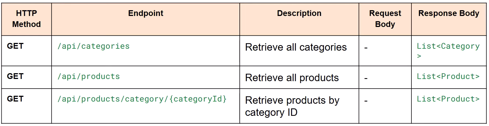

# E-commerce SpringBoot Project

This is a simple E-commerce application built with **Spring Boot**. The project comprises a front-end product catalog and a back-end database for managing products.

---

## Features
- **User-friendly Product Catalog**: A dynamic catalog of products with images, descriptions, and prices.
- **Back-End Database**: A robust database to manage product inventory and categories.
- **RESTful API**: A Spring Boot-based API to interact with the front-end and handle business logic.
  
---

## Screenshots

### Product Catalog Website
Below is a screenshot of the developed **E-commerce Website** showcasing the product catalog:



---

### Back-End Database
This screenshot shows the **Back-End Database** structure that supports the application, managing product data and user orders:



---

## API Documentation

The **E-commerce SpringBoot** project provides a set of RESTful API endpoints to manage products and orders. Below is a table that outlines the key API endpoints:

### API Endpoints Table
Here is an image of the API table showing the various endpoints:



The table above shows the various API methods, URL paths, request/response formats, and descriptions.

---

## Technologies Used
- **Backend**: Spring Boot, Java
- **Frontend**: React and Vite
- **Database**: MySQL
- **Other Tools**: Spring Data JPA, Hibernate

---

## How to Run

1. Clone the repository:
   ```bash
   git clone https://github.com/Harishanan/E-commerce-SpringBoot.git

2. Navigate to the project directory:
   ```bash
   cd ecommerce-springboot

3. Run the application:
   ```bash
   ./mvnw spring-boot:run

4. Open the application in your browser:
   ```bash
   http://localhost:8080/api/products

---

## License
This project is licensed under the MIT License - see the LICENSE file for details.


