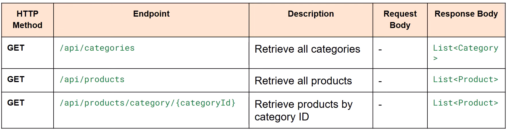

# E-commerce Spring Boot + React Project

This repository contains a full-stack e-commerce application with a **Spring Boot** backend and a **React + Vite** frontend. The backend exposes REST APIs for catalog data, and the frontend renders the product catalog UI.

---

## Features
- **User-friendly Product Catalog**: A dynamic catalog of products with images, descriptions, and prices.
- **Back-End Database**: A robust database to manage product inventory and categories.
- **RESTful API**: A Spring Boot-based API to interact with the front-end and handle business logic.
  
---

## Screenshots

### Product Catalog Website
Below is a screenshot of the developed **E-commerce Website** showcasing the product catalog:


---

### Back-End Database
This screenshot shows the **Back-End Database** structure that supports the application, managing product data and user orders:


---

## API Documentation

The **E-commerce SpringBoot** project provides a set of RESTful API endpoints to manage products and orders. Below is a table that outlines the key API endpoints:

### API Endpoints Table
Here is an image of the API table showing the various endpoints:



The table above shows the various API methods, URL paths, request/response formats, and descriptions.

---
## Project Entry Points

- **Frontend:** `ecom-front/ecom-catalog-react/src/main.jsx` (React + Vite application entry)
- **Backend:** `ecom-project/src/main/java/org/ecom/productcatalog/EcomProjectApplication.java` (Spring Boot application entry)

## Core Dependencies

### Frontend
- `react` `^19.0.0`
- `react-dom` `^19.0.0`
- `bootstrap` `^5.3.3`
- `vite` `^6.3.1`

### Backend
- Java `21`
- Spring Boot `3.4.4`
- `spring-boot-starter-web`
- `spring-boot-starter-data-jpa`
- `mysql-connector-j`
- `h2`

## Language Versions

- **Java:** `21`
- **Node.js:** `20.x`
- **Frontend JavaScript runtime:** ECMAScript modules via Vite

## Repository Structure

- `ecom-project/` - Spring Boot backend service
- `ecom-front/ecom-catalog-react/` - React + Vite frontend service
- `docker-compose.yml` - local multi-service orchestration


## Technologies Used
- **Backend**: Spring Boot, Java
- **Frontend**: React and Vite
- **Database**: H2 for local/containerized runtime, MySQL connector available as a runtime dependency
- **Other Tools**: Spring Data JPA, Hibernate, Docker Compose

---

## How to Run

1. Clone the repository:

   ```bash
   git clone https://github.com/sdixit07/capstoneproject_codemie.git
   ```

2. Navigate to the project directory:

   ```bash
   cd capstoneproject_codemie
   ```

3. Run the full stack with Docker Compose:

   ```bash
   docker compose up --build
   ```

4. Or run the services individually:

   Backend:

   ```bash
   cd ecom-project
   ./mvnw spring-boot:run
   ```

   Frontend:

   ```bash
   cd ecom-front/ecom-catalog-react
   npm install
   npm run dev
   ```

5. Open the application in your browser:

   ```text
   Frontend: http://localhost:5173
   Backend:  http://localhost:8080
   ```

---

## License
This project is licensed under the MIT License - see the LICENSE file for details.


